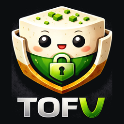
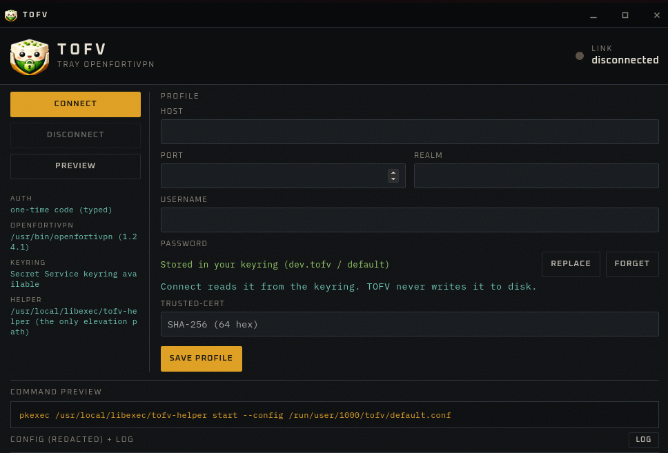

<div align="center">
  

  <h1>TOFV — Tray OpenFortiVPN</h1>

  <p>A small desktop client for <a href="https://github.com/adrienverge/openfortivpn">openfortivpn</a>.</p>

  <p>
    <a href="https://github.com/Altagen/TOFV/actions/workflows/ci.yml"></a>
    <a href="https://github.com/Altagen/TOFV/releases/latest"></a>
    <a href="LICENSE"></a>
  </p>
</div>

---

TOFV does not reimplement the Fortinet protocol. It wraps the
`openfortivpn` binary, which already does that job well, and adds what is
missing day to day: a tray daemon with connection status, a one-screen
profile panel, credentials in your desktop keyring, a one-time-code prompt
at connect time, and a log view that shows the exact command that ran —
with the secrets redacted.

**Platforms:** Linux first, macOS next.
**Out of scope:** Windows, reimplementing the tunnel, replacing FortiClient.

<div align="center">
  
</div>

The panel is the whole surface: one profile, the keyring entry, and the exact
command TOFV would run with your credentials — redacted, and shown before
anything is executed rather than after.

```
 ┌─────────────────────────────────────────────┐
 │  tofv-app (user session, never root)        │
 │                                             │
 │  tray ──► status + Connect / Disconnect     │
 │    └─ panel: profile, one-time code, log    │
 │                                             │
 │  tofv-core ── keyring (libsecret / Keychain)│
 │       ├─ writes /run/user/$UID/tofv/<id>.conf
 │       │   (0600, holds the OTP, never the password)
 │       └─ pinentry-tofv (pinentry protocol)  │
 └───────────────┬─────────────────────────────┘
                 │  pkexec → tofv-helper (allowlisted)
                 ▼
         openfortivpn -c <conf> --pinentry=… -v
                 │
                 ▼
               pppd + routes + DNS
```

## Why

The CLI works fine. What is tedious is the ceremony at every session:
remember the gateway certificate fingerprint, retype username / password /
realm, read the 6-digit code off the token, run the whole thing under
`sudo`, then babysit the process.

TOFV sits *on top of* `openfortivpn` rather than beside it. It is not a new
VPN client, not a homemade secret store, and not a NetworkManager plugin.

## Security model

These rules are the point of the project, not a footnote:

1. The UI and tray never run as root.
2. The password never appears in a process argument, in `~/.config`, in the
   logs, or on the clipboard. It reaches root `openfortivpn` through a
   pinentry helper over a `0600` unix socket.
3. The one-time code lives in an ephemeral `0600` config for the duration of
   one attempt; the file is unlinked afterwards.
4. `trusted-cert` is explicit pinning. `--insecure-ssl` is never an option.
5. `--insecure-ssl`, `--pppd-plugin` and `--pppd-log` are absent from the IPC
   API and rejected by the helper. A root `openfortivpn` that accepts
   `--pppd-plugin` is arbitrary code execution.
6. Elevation goes **only** through `tofv-helper` under Polkit — never
   `pkexec openfortivpn`, never `pkexec /bin/sh`. The helper validates the
   config on the file descriptor it reads from, copies it into a root-owned
   `0600` file, and execs with a fixed argv.
7. The TypeScript frontend has no `shell` or `fs` capability: only the
   declared Tauri commands.
8. The UI makes no outbound request of its own. Fonts are bundled, and the
   Content Security Policy allows no remote origin at all — so opening the
   panel cannot announce itself to a third party, and it works offline.

Found a problem? See [SECURITY.md](SECURITY.md).

## Install

Three paths — pick **one**. Do not mix a distro package with
`./scripts/install.sh`: you would end up with two helpers, two `.desktop`
files and two Polkit rules fighting each other.

TOFV is only a wrapper: `openfortivpn` and `pppd` must exist on the machine.
`tofv doctor` (and the first-run screen) prints the distro command when
something is missing.

### 1. Distro package

```sh
sudo pacman -S tofv     # Arch/CachyOS: packaging/arch/PKGBUILD
tofv-app
```

Pulls `openfortivpn`, `ppp`, `libsecret`, the helper, the Polkit policy and
the launcher. Do **not** run `install.sh` afterwards.

### 2. From source

Requires Podman and Node, plus the runtime packages.

```sh
git clone https://github.com/Altagen/TOFV.git
cd TOFV
./scripts/install.sh
tofv doctor
tofv-app
```

Builds in release, installs the helper into `/usr/local/libexec` (needs
sudo), the `.desktop` entry, the autostart entry and `~/.local/bin/tofv-app`.
Re-run `./scripts/install.sh` after every `git pull`.

### 3. Binary tarball, or Ora

For a machine that already has `openfortivpn` but no TOFV package and no Rust
toolchain. Every release publishes a `linux-x86_64` tarball.

With [Ora](https://github.com/Altagen/Ora):

```sh
ora install tofv
```

Ora installs into `~/.local` without root, which covers `tofv-app` and `tofv`.
TOFV also needs its root helper and polkit rule before Connect will work, so
finish with `install-bin.sh` from the tarball (or `scripts/install-helper.sh`
from a checkout). The first-run screen says so too.

By hand:

```sh
tar xf tofv-0.1.0-linux-x86_64.tar.gz
cd tofv-0.1.0-linux-x86_64
./install-bin.sh      # same as install.sh, without the build step
tofv-app
```

The tarball carries `tofv-app`, `tofv`, `tofv-helper`, `pinentry-tofv`, the
polkit policy, the `.desktop` entry and the icons. It does **not** carry
`openfortivpn`, `pppd`, GTK/WebKit or `libsecret` — those stay distribution
packages. glibc x86_64; not musl, not an old distribution.

### Verifying a download

Each release ships `SHA256SUMS.txt` covering every published file, and
`tofv-<version>-sbom.json`, a CycloneDX SBOM of the whole dependency tree —
Rust and npm in one document.

```sh
sha256sum -c SHA256SUMS.txt --ignore-missing
```

### Runtime requirements

- `openfortivpn` — prove it works from the CLI before using TOFV
- `pppd` (Linux)
- a Secret Service daemon: `secret-tool` / libsecret (KWallet, gnome-keyring, …)
- `pkexec` (polkit)
- WebKitGTK 4.1 + GTK3
- optional: `libayatana-appindicator` for the tray icon (without it the panel
  opens instead; on GNOME you also need the AppIndicator extension)

## Use

The tray daemon runs on its own; the panel only opens when you ask for it.

**First run.** Open the panel, fill in host, port, username, realm and
password, and save — the password goes to the keyring, the rest to
`~/.config/tofv/profiles/default.toml`. Click Connect: a small window asks
for the 6-digit code. If the gateway certificate is unknown, TOFV shows the
SHA-256 fingerprint and asks before pinning it.

**Afterwards.** Tray → Connect → type the code → connected.

### The password and your keyring

You type the VPN password **once**. "Store in keyring" hands it to your
desktop's Secret Service daemon — KWallet, gnome-keyring, KeePassXC, whatever
you already use — and TOFV forgets it. The input then disappears and the panel
shows what is stored instead, so an empty form is never ambiguous:

- **Replace** brings the input back, to store a new password.
- **Forget** deletes the entry from the keyring. Connect will refuse until you
  store one again.

TOFV never writes the password to disk itself, and never passes it on a
command line. At connect time root `openfortivpn` asks `pinentry-tofv` for it,
which fetches it from your session over a `0600` socket.

The entry is a normal keyring item, so you can inspect or delete it with your
own tools — look for service `dev.tofv`, account `default`:

```sh
secret-tool lookup service dev.tofv username default   # prints it
secret-tool clear  service dev.tofv username default   # same as Forget
```

In KWalletManager or Seahorse it appears as *TOFV password (default)*.

If your keyring is locked when you click Connect, your desktop will prompt to
unlock it — that prompt comes from the wallet, not from TOFV.

**Preview.** Shows the exact command TOFV would run and the config it would
write, with the one-time code and any other secret already redacted, *without
connecting*. It is there so you never have to take the wrapper's word for what
it does with your credentials — the same text is what the log window shows
during a real connection.

**Certificate rotation.** If the gateway's certificate changes, TOFV reopens
the trust dialog with the old and new fingerprints side by side instead of
failing silently.

| Command | Effect |
| --- | --- |
| `tofv-app` | panel + tray, detaches from the terminal |
| `tofv-app --tray` | tray only (used by autostart; never autoconnects) |
| `tofv-app --foreground` | stays in this terminal, for logs and debugging |
| closing the window | hides the panel, the tray stays |

## Development

There is no Rust toolchain on the host: it lives in a Podman image, the same
one the CI uses.

```sh
./scripts/cargo.sh test --workspace
./scripts/cargo.sh clippy --workspace -- -D warnings

# panel + tray (UI built on the host, Rust binary in Podman)
./scripts/build-app.sh
./target/debug/tofv-app --foreground
```

The debug binary loads `ui/dist`, not the Vite dev server, so the window
stays blank until `npm run build` has run at least once. If the
`Containerfile` changes, rebuild with `TOFV_REBUILD=1 ./scripts/build-app.sh`.

There is also a CLI, which is the easiest way to exercise `tofv-core`:

```sh
./target/debug/tofv doctor
./target/debug/tofv profile set \
    --host vpn.example.com --port 443 --username alice --realm corp
printf '%s' 'secret' | ./target/debug/tofv profile password   # stdin, never argv
./target/debug/tofv connect --otp 123456 --dry-run
./target/debug/tofv trust <sha256>
```

## Documentation

- [docs/design.md](docs/design.md) — why openfortivpn, what its options mean
  for a GUI, the stack choice, the architecture, and the decisions already
  settled.
- [BACKLOG.md](BACKLOG.md) — what is planned.
- [CONTRIBUTING.md](CONTRIBUTING.md) — how to build, test and submit changes.

## Licence

TOFV is MIT licensed — see [LICENSE](LICENSE).

`openfortivpn` is GPL and stays an **external process**: TOFV executes it, it
does not link against it. The security rules above are TOFV's responsibility,
not openfortivpn's.
